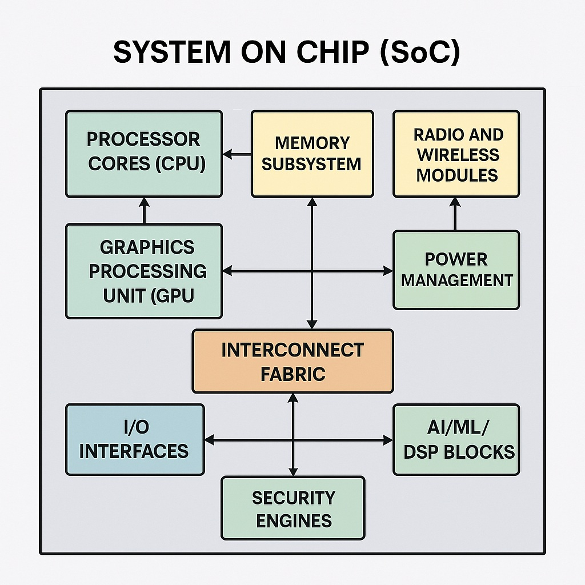
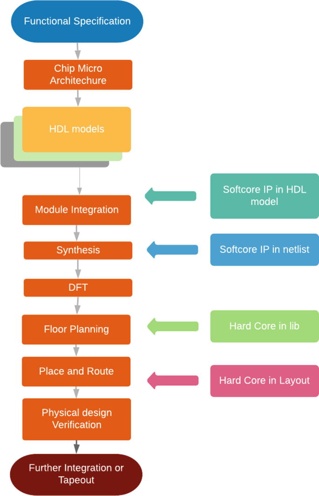

# My Understanding of SoC Design Fundamentals and the Role of VSDBabySoC in My Learning Journey

As part of my journey into VLSI and SoC design through the SFAL-VSD program, I've been diving into the basics of System-on-Chip (SoC) architectures. This write-up, expanded with more in-depth insights, summarizes what I've learned so far, drawing from readings, simulations, and hands-on work with the VSDBabySoC project. I'll explain SoC concepts in simple terms, highlight key components with real-world examples, and reflect on how building and simulating VSDBabySoC has helped me connect theory to practice. This is based on my notes from the program materials and experiments—it's been an eye-opener to see how these tiny chips power everything from phones to smart devices. I've included visuals to illustrate concepts, making the learning process more engaging.

## What is a System-on-Chip (SoC)?

From what I gather, a System-on-Chip (SoC) is essentially a complete electronic system crammed onto a single silicon die. Instead of having separate chips for processing, memory, and peripherals connected on a board, everything is integrated. This makes devices smaller, cheaper to produce, and more efficient in terms of power and speed. Imagine your smartphone's brain: the processor, graphics unit, and wireless modules all living together on one chip—that's an SoC in action.

To put it technically, an SoC combines digital logic (e.g., gates and flip-flops), analog circuits (e.g., amplifiers and converters), and sometimes radio-frequency (RF) components on one substrate using CMOS technology. It evolved from earlier integrated circuits (ICs) like microprocessors in the 1970s, but takes integration further by including entire subsystems. For example, Apple's A-series chips or Qualcomm's Snapdragon processors are classic SoCs, handling CPU tasks, GPU rendering, AI acceleration, and connectivity all in one package. The shift to SoCs was driven by Moore's Law, allowing billions of transistors on a chip, but now faces limits with scaling below 3nm.

SoCs are everywhere: in embedded systems (e.g., Raspberry Pi), consumer electronics (e.g., smart TVs), and automotive (e.g., ADAS systems). They enable edge computing, where processing happens locally rather than in the cloud, reducing latency and bandwidth needs.

*Figure 1: A visual representation of a typical SoC architecture, showing integrated components like CPU, memory, and peripherals (Source: Wiki). This diagram highlights how diverse blocks coexist on one die, emphasizing interconnects for data exchange.*

### Advantages I've Noted:
- **Compactness and Portability**: By packing everything tight, SoCs enable slim devices like wearables or IoT sensors. For instance, fitness trackers can fit advanced features into a wristband because the SoC minimizes space—think of the Apple Watch's S-series SoC, which integrates CPU, GPU, and sensors in under 1 cm².
- **Power Savings**: Shorter connections mean less energy lost to resistance and capacitance, which is crucial for battery life. In mobile devices, this can extend usage by hours, as data doesn't travel long distances across a PCB. Techniques like power gating (turning off unused blocks) further optimize this.
- **Faster Performance**: Data moves quicker without jumping between chips, reducing latency. This is vital for real-time applications like gaming or autonomous driving, where milliseconds matter—e.g., NVIDIA's Tegra SoC in cars processes sensor data in microseconds.
- **Lower Costs**: Manufacturers save on assembly and materials by reducing the number of discrete components. Mass production of SoCs also benefits from economies of scale, with fab costs amortized over millions of units.
- **Better Reliability**: Fewer connections reduce failure risks, such as solder joint issues. In harsh environments (e.g., automotive), this means longer lifespans and fewer repairs—SoCs like those in Tesla vehicles endure extreme temperatures without degradation.

### Challenges:
- Designing an SoC is tricky due to heat buildup from crowded components—thermal management is a big deal to prevent throttling or failures, often requiring advanced cooling or FinFET transistors.
- The difficulty of fixing bugs post-fabrication means extensive verification is needed, as silicon revisions are expensive (millions in masks alone).
- Mixing analog and digital signals can cause noise interference, requiring careful isolation like guard rings or separate power domains.
- Scalability issues arise as transistor sizes shrink (e.g., below 7nm), leading to quantum effects (e.g., tunneling) and higher costs—prompting alternatives like chiplets.
- Intellectual Property (IP) integration from different vendors can lead to compatibility headaches, such as timing mismatches or protocol conflicts.

Overall, SoCs represent a pinnacle of semiconductor engineering, balancing trade-offs in performance, power, area (PPA), and cost. The industry is shifting toward heterogeneous integration to overcome scaling limits.

## Core Components of an SoC

An SoC typically includes several building blocks, each handling specific tasks. Here's my breakdown with more depth, including how they interact:

- **Processor (CPU)**: The heart that runs code and makes decisions. It could be a general-purpose one (e.g., ARM Cortex-A for apps) or specialized for tasks like AI (e.g., tensor processing units in Google's TPUs). In VSDBabySoC, the RVMYTH CPU is a simple RISC-V implementation, supporting basic instructions like ADDI and BNE, which I've simulated to see how it fetches and executes code. Multi-core setups (e.g., big.LITTLE) allow efficient task distribution.
- **Memory Units**: On-chip RAM (SRAM for speed, DRAM for density) for quick access and flash for storing firmware. This is where data lives temporarily or permanently. Caches (L1/L2) reduce latency by storing frequently used data close to the CPU—e.g., in Qualcomm chips, L3 cache shares across cores for better performance. In complex SoCs, memory controllers manage off-chip expansions like DDR4.
- **Input/Output Interfaces**: Things like USB ports, sensors, or wireless radios (e.g., Wi-Fi, Bluetooth) to talk to the outside world. These peripherals handle data transfer protocols, often with DMA (Direct Memory Access) to offload the CPU—e.g., in IoT SoCs like ESP32, BLE interfaces enable low-power connectivity.
- **Graphics and Signal Processors**: GPUs for visuals (e.g., rendering 4K video in Adreno GPUs) and DSPs for handling audio or video streams. In mobile SoCs, these are power-optimized for battery efficiency—e.g., Hexagon DSP in Snapdragon for voice recognition.
- **Power Management Circuits**: To regulate voltage and clock speeds (e.g., DVFS - Dynamic Voltage and Frequency Scaling), keeping things efficient. This prevents overheating and extends battery life—e.g., PMICs in SoCs dynamically throttle cores based on load.
- **Specialized IPs**: Custom blocks like accelerators for encryption (e.g., AES engines), machine learning (e.g., NPUs in Huawei Kirin), or image processing. These are reusable modules licensed from vendors (e.g., Arm Mali GPU IP) to speed up design and reduce time-to-market.

Interconnects like buses (AMBA, AXI) or NoCs (Network-on-Chip) tie everything together, ensuring efficient data routing without bottlenecks. For example, AXI buses support burst transfers for high-bandwidth needs like video streaming.

## Types of SoCs

SoCs come in different flavors based on their focus, which I've categorized below with examples and use cases:

- **Microcontroller-Based**: These are for simple, low-power tasks with embedded flash and RAM. They're ideal for control-oriented applications like home automation (e.g., ESP32 SoC in smart bulbs) or automotive sensors (e.g., STM32 in engine control units). Power consumption is prioritized over speed, often running at MHz frequencies with integrated ADCs for sensor data.
- **Microprocessor-Based**: More powerful, capable of running full operating systems like Android or Linux. These power smartphones (e.g., Snapdragon 8 Gen 1 with octa-core CPU) and tablets, handling multitasking, high-res graphics, and connectivity. They balance performance with power, using multi-core setups and advanced process nodes (e.g., 4nm for efficiency).
- **Application-Specific**: Designed for niche jobs, like graphics in gaming consoles (e.g., AMD SoC in PlayStation 5 with custom GPU) or AI in edge devices (e.g., Google's Edge TPU for on-device ML inference). They're optimized for speed in one area, sacrificing generality—great for cost-sensitive, high-volume products like smart cameras or medical imaging devices.

Choosing the type depends on the application—power constraints, performance needs, and cost. For learning, VSDBabySoC fits as a microcontroller-based example with a RISC-V core, emphasizing low-power digital-analog integration.

## The SoC Design Flow

Designing an SoC is a multi-step process, and I've started appreciating how iterative it is. It roughly goes like this (with a visual for clarity):

*Figure 2: The typical SoC design flow, from specification to fabrication (Source: Reference materials). This flowchart shows the sequential and feedback-driven nature of the process.*

1. **Planning and Specs**: Define what the SoC needs to do, like clock speed, power budget, or interfaces. This includes market analysis, requirement gathering, and feasibility studies to avoid over-designing.
2. **Architecture**: Decide on blocks (e.g., CPU type) and how they connect (e.g., buses like AXI). Tools like SystemC or UML help model at a high level, simulating system behavior before coding.
3. **RTL Coding**: Write hardware descriptions in Verilog or VHDL. This is where IPs are integrated—e.g., adding a RISC-V core or PLL block. Version control (e.g., Git) is essential here for team collaboration.
4. **Verification**: Simulate to catch bugs (this is where Icarus Verilog and GTKWave come in). Functional (behavior), timing (STA), and power (UPF) simulations ensure correctness—e.g., emulating reset sequences or clock domains.
5. **Synthesis**: Turn code into gates using tools like Yosys or Synopsys DC, optimizing for area, power, and timing (PPA). Constraints (SDC files) guide this step.
6. **Physical Design**: Layout the chip, place components, and route wires (e.g., with OpenLANE or Cadence Innovus). This handles floorplanning, clock tree synthesis (CTS), and sign-off checks like DRC (Design Rule Check) and LVS (Layout vs. Schematic).
7. **Tapeout and Fab**: Send GDSII files for manufacturing at foundries like TSMC. Post-fab testing (e.g., ATE) verifies the chip, with yield analysis for production tweaks.

From my experience, verification is key—simulating VSDBabySoC helped me spot mismatches early. The flow is iterative, with feedback loops (e.g., resynthesize if timing fails), and tools like ModelSim or VCS aid in debugging.

## Introduction to VSDBabySoC

VSDBabySoC is a simplified SoC project that's perfect for beginners like me. It's built around a RISC-V processor (RVMYTH), a PLL for clocking, and a 10-bit DAC for analog output. The goal is to test these open-source IPs together and learn mixed-signal design. Unlike complex commercial SoCs, it's stripped down to essentials, making it easier to grasp integration challenges. The project emphasizes open-source tools, aligning with the SFAL-VSD ethos.

### How It Works:
- Start with an input to kick off the PLL, which creates a synced clock from a reference signal, avoiding external crystal dependencies. The PLL adjusts dynamically, modeling real-world frequency locking.
- RVMYTH processes data using a predefined instruction set, updating register r17 with computed values through a loop of additions and subtractions. It supports RV32I basics, with a 5-stage pipeline for fetch-decode-execute-memory-writeback.
- DAC converts those digital values (10-bit from r17) to analog signals for external use, like audio/video output, scaled between VREFL and VREFH. This highlights digital-to-analog conversion principles.
- The testbench simulates inputs like reset and clock references, monitoring the analog OUT. In my runs, I saw r17 accumulate to 43 decimal (from the loop) before outputting.

This flow mirrors real SoCs but at a manageable scale, with ~13 instructions preloaded for a basic computation loop.

### Components Breakdown
- **RVMYTH**: A basic RISC-V CPU implementing RV32I ISA subset. It's open-source, so I could tinker with its code in Verilog. It handles simple instructions like ADDI, ADD, SUB, and branches (BNE, BEQ). In simulation, I saw the PC increment and registers update—e.g., r17 accumulating loop results up to a branch termination.
- **PLL (avsdpll)**: Locks the clock to a reference, modeling behavioral adjustment (period = refpd / 8). This avoids off-chip clock issues like jitter or delays. In waveforms, I observed CLK stabilizing post-reset, with frequency division for core syncing.
- **DAC (avsddac)**: A 10-bit converter using a simple scaling formula: OUT = VREFL + (D / 1023) * (VREFH - VREFL). It's R-2R ladder-based in concept, ideal for learning analog-digital interfaces. Simulation showed digital RV_TO_DAC translating to analog OUT, with VREFH=3.3V for scaling.

**Why avoid off-chip clocks?** Delays from board traces (picoseconds add up), jitter from noise (affects timing closure), varying frequencies across batches (manufacturing variance), and crystal inaccuracies (ppm errors, temperature drift up to 50ppm) can cause timing issues. On-chip PLLs provide clean, adjustable clocks, often with feedback loops for stability.

## How VSDBabySoC Fits into My Learning Journey

Working on VSDBabySoC has been a game-changer, bridging theory and practice. Cloning the repo, running `make pre_synth_sim`, and analyzing waveforms in GTKWave made abstract concepts real—I saw the reset pulse initialize registers (e.g., x17=17), the clock stabilize via PLL (from 25ns initial to ref-adjusted), and data flow from CPU (r17 updates) to DAC (analog OUT scaling).

It taught me mixed-signal challenges, like ensuring digital noise doesn't affect analog DAC output (e.g., via separate domains), and the benefits of open-source tools (e.g., customizing RVMYTH in Verilog for custom instructions). Debugging simulation mismatches (e.g., initial compilation errors due to file paths, as in my log where `baby_soc.v` was missing) honed my verification skills, preparing me for advanced topics like synthesis (Yosys netlist) and timing analysis (STA in OpenSTA).

Overall, VSDBabySoC is a hands-on intro to SoC design, showing how these chips underpin modern tech. It reinforced why verification is 70% of the design effort—catching issues early saves time and cost (e.g., avoiding costly tapeout revisions). I'm excited to explore physical design next, perhaps taping out a simple SoC using Sky130 PDK!
